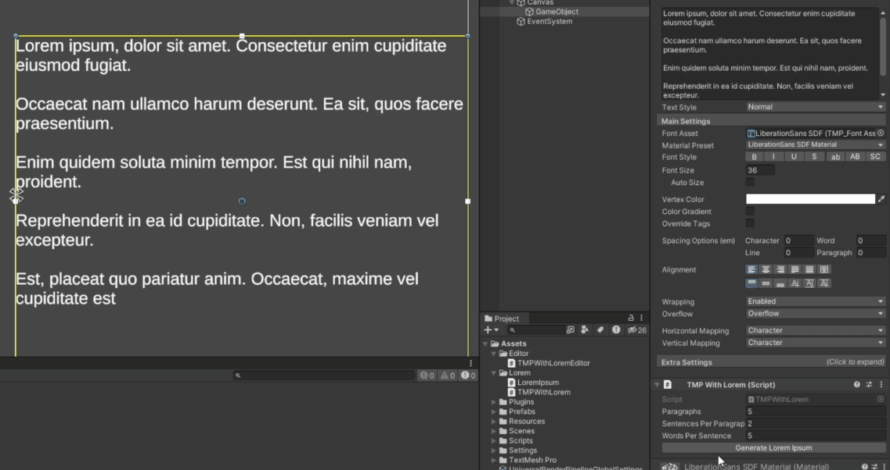
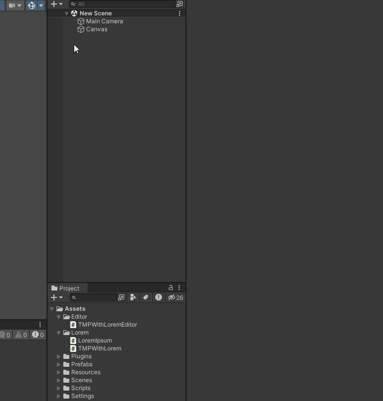

# TextMeshProUGUI Lorem Ipsum

## About The Project

Are you tired of coming up with stupid placeholders for your text objects in Unity?
Do you have no time to insert random keys to fill that stupid field because you don't know if the text will fit?
Or do you just want to learn Latin?

INTRODUCING

## LOREM IPSUM GENERATOR

Now you can easily generate as much unintelligible text as your soul desires. 
Just enter the number of paragraphs, sentences and words, press a button and you're done!

## How to use

All you have to do is right-click and select TextMeshPro - Lorem Ipsum from the UI tab. And boom, you can use it.

## Possibilities

You can generate up to 5 paragraphs. Each can contain 10 sentences of up to 50 words. This is more than enough to satisfy all those thirsty for Latin gibberish.
